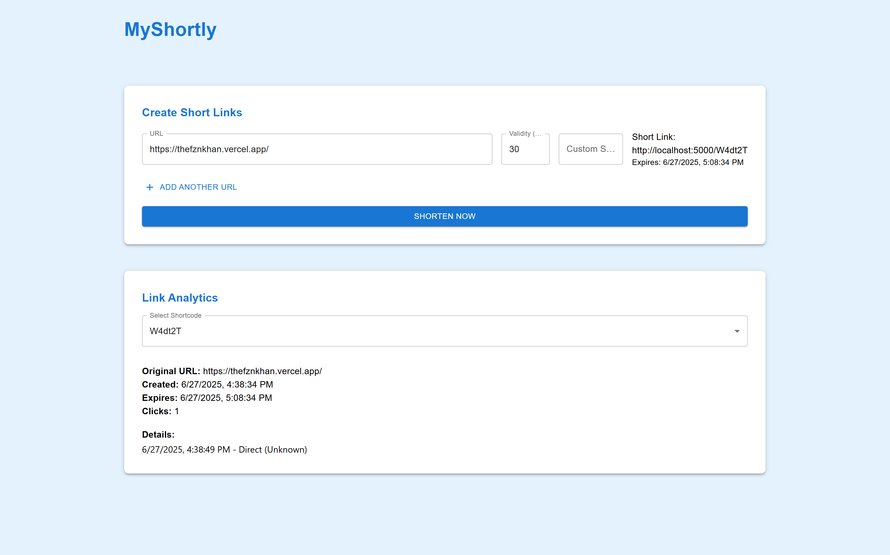
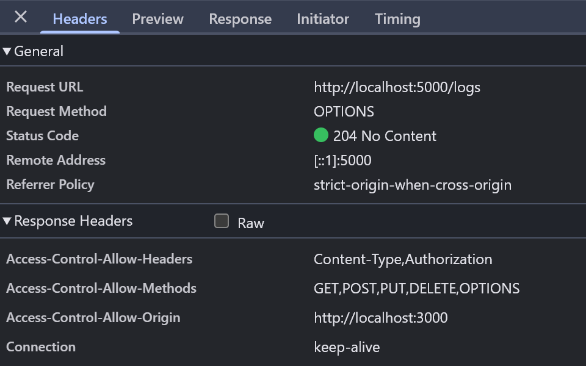

<!-- Banner -->
<p align="center">
    
</p>

<h1 align="center">🔗 URL Shortener</h1>
<p align="center">
    <b>A modern, full‑stack URL shortening app with analytics & external logging.</b>
</p>

<p align="center">
    
    
</p>

---

## 📚 Table of Contents

- [Overview](#overview)
- [Features](#features)
- [Tech Stack](#tech-stack)
- [Folder Structure](#folder-structure)
- [Architecture](#architecture)
- [Getting Started](#getting-started)
    - [Prerequisites](#prerequisites)
    - [Backend Setup](#backend-setup)
    - [Frontend Setup](#frontend-setup)
- [Environment Variables](#environment-variables)
- [API Endpoints](#api-endpoints)
- [Usage](#usage)
- [License](#license)

---

## 📝 Overview

**URL Shortener** is a full-stack project featuring:

- 🚀 RESTful **Express** API for URL shortening
- 🎨 **React + Vite** frontend with **Material UI**
- 🔒 Secure, external logging middleware with bearer token authentication

---

## ✨ Features

- **Shorten URLs** — auto-generated or custom shortcodes
- **Set Expiration** — define link validity in minutes
- **Click Analytics** — track total clicks, timestamps, referrers, and locations
- **External Logging** — all key events logged securely

---

## 🛠️ Tech Stack

| Backend         | Frontend                | Logging                |
|-----------------|------------------------|------------------------|
| Node.js         | React                  | Custom Middleware      |
| Express         | Vite                   | Axios                  |
| TypeScript      | TypeScript             | External Auth & Logs   |
| Axios, dotenv   | Material UI            |                        |

---

## 📁 Folder Structure

```text
logging-middleware/
├── backend/
│   ├── src/
│   │   ├── app.ts
│   │   ├── routes/
│   │   │   └── urlRoutes.ts
│   │   ├── controllers/
│   │   ├── services/
│   │   ├── utils/
│   │   │   └── logger.ts
│   │   └── config/
│   ├── .env
│   ├── package.json
│   └── tsconfig.json
└── frontend/url-shortener/
        ├── src/
        │   ├── components/
        │   │   ├── ShortenUrl.tsx
        │   │   └── UrlStats.tsx
        │   ├── services/
        │   │   └── api.ts
        │   ├── App.tsx
        │   └── main.tsx
        ├── vite.config.ts
        ├── package.json
        └── tsconfig.json
```

---

## 🏗️ Architecture

### High‑Level Components

<p align="center">
    
</p>

---

## 🚀 Getting Started

### Prerequisites

- [Node.js](https://nodejs.org/) v16+
- npm
- (Optional) Postman or cURL

---

### Backend Setup

```bash
cd backend
npm install
```
- Rename `.env.example` → `.env`
- Fill in your credentials (see [Environment Variables](#environment-variables))

```bash
npm run build
npm start
```
> Server runs on **http://localhost:5000**

---

### Frontend Setup

```bash
cd frontend/url-shortener/
npm install
```
- Create `.env`
- Set `VITE_API_BASE` to your backend URL (e.g. `http://localhost:3000`)

```bash
npm run dev
```
> App opens at **[http://localhost:3000](http://localhost:3000)**

---

## 🔑 Environment Variables

<details>
<summary><b>Backend (<code>backend/.env</code>)</b></summary>

```dotenv
PORT=5000
EMAIL=your_university_email@domain.edu
NAME=Your Full Name
ROLL_NO=your_roll_number
ACCESS_CODE=code_from_email
CLIENT_ID=obtained_client_id
CLIENT_SECRET=obtained_client_secret
```
</details>

<details>
<summary><b>Frontend (<code>frontend/.env</code>)</b></summary>

```dotenv
VITE_API_BASE=http://localhost:3000
```
</details>

---

## 📡 API Endpoints

### ➕ Create Short URL

```http
POST /shorturls
Content-Type: application/json

{
    "url": "https://example.com",
    "validity": 30,
    "shortcode": "optionalCustomCode"
}
```

**Response:**
```json
{
    "shortLink": "http://localhost:5000/abc123",
    "expiry": "2025-06-30T12:34:56.789Z"
}
```

---

### 📊 Get URL Stats

```http
GET /shorturls/:code
```

**Response:**
```json
{
    "shortcode": "abc123",
    "originalUrl": "https://example.com",
    "createdAt": "2025-06-30T11:00:00.000Z",
    "expiresAt": "2025-06-30T12:00:00.000Z",
    "totalClicks": 5,
    "clicks": [
        {
            "timestamp": "2025-06-30T11:05:00.000Z",
            "referrer": "https://referrer.com",
            "location": "New York, USA"
        }
    ]
}
```

---

## 🧑‍💻 Usage

1. **Shorten a URL** via the frontend form
2. **Copy the returned short link** and open it in a new tab
3. **View analytics** in the “Link Analytics” component

---

<p align="center">
    <b>🚀 Happy Shortening!</b>
</p>
